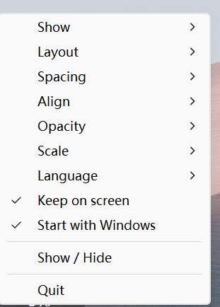
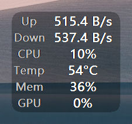
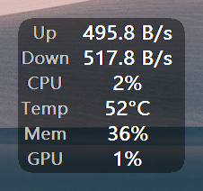
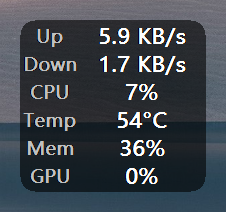
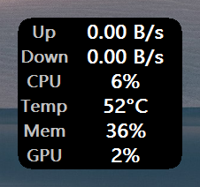

# deskpulse

[English](../README.md) | 中文

一个由纯 Rust 实现的常驻桌面的 Windows 悬浮窗，实时显示系统状态：

- 上传 / 下载网速
- CPU 占用率 + CPU 温度
- 内存占用率
- 显卡占用率 + GPU 温度（NVIDIA，走 NVML）
- 显存

技术栈：纯 Rust，用原生 Win32 分层窗口 + GDI 绘制。

> 详细功能见 [FUNCTIONALITIES.zh.md](FUNCTIONALITIES.zh.md) · 技术栈、架构与设计取舍见 [ARCHITECTURE.zh.md](ARCHITECTURE.zh.md)。

## 界面

所有设置都在右键菜单里（托盘图标打开的是同一个菜单，同一份代码构建）：



| 菜单项 | 作用 |
| --- | --- |
| **显示数据** ▸ | 勾选要显示的指标；隐藏的项不占空间，面板随之缩小 |
| **布局** ▸ | 竖排 / 横排 / 竖两排 |
| **间距** ▸ | 紧凑 / 宽松 —— 行与行之间的垂直间距 |
| **对齐** ▸ | 单元格内名称与数值的左 / 居中 / 右对齐 |
| **透明度** ▸ | 30 / 45 / 60 / 72 / 85 / 100 % 背景不透明度 |
| **缩放** ▸ | 50 / 75 / 100 / 125 / 150 / 175 %，**在显示器缩放比例之上**再叠加 |
| **语言** ▸ | 中文 / English |
| **保持在屏内** | 面板拖不出所属显示器；放大后或显示器变化后会被自动拉回 |
| **开机自启** | 登录计划任务，因此 CPU 温度在无 UAC 提示的情况下也能工作 |
| **显示 / 隐藏** | 暂时隐藏面板，不退出 |
| **退出** | 退出程序 |

### 透明度

只有面板背景是半透明的，文字始终以完全不透明绘制，因此每一档都清晰可读。下面依次是 30 %、45 %、72 %（默认）和 100 %：

| 30 % | 45 % | 72 %（默认） | 100 % |
| --- | --- | --- | --- |
|  |  |  |  |

## 构建与运行

```powershell
cargo run --release
```

运行后在桌面出现悬浮窗，鼠标拖动可移动。**右键**打开设置菜单（见[界面](#界面)）：显示哪些指标、布局、间距、对齐、透明度、缩放、语言、保持在屏内与开机自启两个开关、显示/隐藏、退出。

诊断模式（不打开窗口，打印 5 次采样后退出）：

```powershell
cargo run -- --dump
```

## 性能

在开发机上实测（除悬浮窗外桌面处于空闲）：

| | |
| --- | --- |
| 处理器 | AMD Ryzen 5 9600X（6 核 / 12 线程） |
| CPU 占用 | **约 0.29% 单核**（约占整机 CPU 的 0.02%） |
| 私有内存 | **约 27 MB** |
| 工作集 | 约 43 MB |
| `deskpulse.exe` | **1.05 MB** |

## 打包成独立 exe

```powershell
cargo build --release
Copy-Item .\target\release\deskpulse.exe .\dist\deskpulse.exe
```

## 文件结构

```
deskpulse/
├── Cargo.toml               # 依赖与 release 优化档
├── build.rs                 # 嵌图标 / 版本信息（winresource）
├── .cargo/config.toml       # x86_64-pc-windows-msvc: +crt-static
├── assets/
│   ├── icon.ico             # 应用图标
│   ├── make-icon.ps1        # 图标生成脚本
│   ├── AMDFamily17.bin      # PawnIO 模块（AMD SMN）
│   └── IntelMSR.bin         # PawnIO 模块（Intel MSR）
├── docs/                    # 截图与中文文档
└── src/
    ├── main.rs              # 入口、--dump 诊断、自提权
    ├── overlay.rs           # 模块根：窗口生命周期、消息循环、拖动
    ├── overlay/             # 界面，按职责拆分
    │   ├── win32.rs         # 原生 Win32 声明（FFI 块与值类型）
    │   ├── metric.rs        # 可显示的指标
    │   ├── canvas.rs        # GDI 位图/字体与文字测量
    │   ├── layout.rs        # 名称/数值矩形的位置计算
    │   ├── paint.rs         # 单次重绘
    │   ├── menu.rs          # 控制菜单（右键 + 托盘）及其动作
    │   ├── topmost.rs       # 保持在其它置顶窗口之上
    │   └── dpi.rs           # DPI 感知、布局缩放、保持在屏内
    ├── config.rs            # 配置读写 + 旧目录迁移
    ├── i18n.rs              # 中英文文案 + 系统语言检测
    ├── format.rs            # 速率 / 百分比 / 温度格式化
    ├── tray.rs              # 托盘图标（菜单由 `overlay` 提供）
    ├── autostart.rs         # 计划任务自启（schtasks）
    ├── elevate.rs           # 未提权时用 UAC 重启自己
    ├── single_instance.rs   # 每个登录会话只允许一个悬浮窗
    ├── diag.rs              # %APPDATA%\deskpulse\diag.log
    ├── wide.rs              # 补 NUL 的 UTF-16 字符串
    └── metrics/
        ├── mod.rs           # Snapshot + 采集线程 + 百分比
        ├── net.rs           # sysinfo 网卡差分（过滤虚拟网卡）
        ├── system.rs        # sysinfo CPU 占用 + 内存（共用一个 System）
        ├── gpu.rs           # NVIDIA NVML：占用 / 温度
        ├── gpu_mem.rs       # 显存：取 GPU Adapter Memory 性能计数器
        ├── pawnio.rs        # PawnIO 内核驱动直读 CPU 温度
        └── temp.rs          # 温度：PawnIO 优先，LHM HTTP 退路
```

## 指标与数据来源

| 指标 | 数据来源 | 本机实测 |
| --- | --- | --- |
| 上传/下载网速 | `sysinfo` 网卡累计字节差分 | 正常 |
| CPU 占用率 | `sysinfo` | 正常 |
| CPU 温度 | 优先 PawnIO 内核驱动直读；否则 LHM HTTP | 正常（Tctl/Tdie） |
| 内存占用率 | `sysinfo` | 正常 |
| GPU 占用 / 温度 | NVIDIA NVML | 正常 |
| 显存 | `GPU Adapter Memory` 性能计数器：专用 + 借用的总和，因此可以超过 100 %（NVML 只报专用，作为回退） | 正常（同一帧 65 %，纯专用口径 55 %） |

CPU 温度的细节（为什么必须内核驱动、PawnIO 协议、提权要求）见 [ARCHITECTURE.zh.md](ARCHITECTURE.zh.md)。

## 已知限制

- **真·独占全屏的游戏无法叠加显示。** 把该游戏改成「无边框」或「窗口」模式即可；机制、实测过的游戏，以及为什么不做注入，见 [FUNCTIONALITIES.zh.md](FUNCTIONALITIES.zh.md#8-需求与限制)。
- **直读 CPU 温度需要管理员权限**（PawnIO 设备的限制）；非管理员运行时退到 LibreHardwareMonitor，否则显示 `--`。
- **GPU 占用与 GPU 温度需要 NVIDIA 显卡**（NVML）。其余指标（含显存）在任何显卡上都可用；未知值一律显示 `--`，绝不用 `0` 冒充。

## 许可证

[MIT](../LICENSE) © 2026 XIONG Shihao
